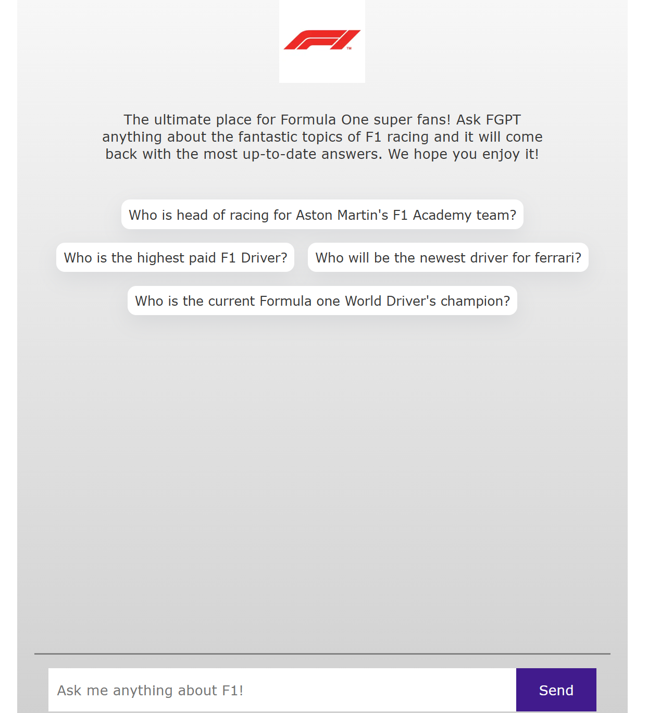

# F1 Chatbot with RAG and Ollama

A Formula 1 chatbot that uses Retrieval-Augmented Generation (RAG) technique to provide accurate and up-to-date information about Formula 1. The project combines local Ollama models with vector database storage to create an intelligent chat system with enhanced accuracy.



## Overview

This is a [Next.js](https://nextjs.org) project that implements a chatbot specifically focused on Formula 1 topics. It uses RAG (Retrieval-Augmented Generation) to improve the accuracy of LLM responses by incorporating the latest F1 information.

## Credits
This project was inspired by @aniakubow's tutorial on building a RAG-based chatbot using OpenAI.

### What Makes This Special?

Traditional LLMs might provide outdated information due to their training cutoff dates. For example, when asked about Ferrari F1 drivers for 2024:

- **Without RAG**: Incorrectly returns "Sebastian Vettel and Charles Leclerc"
- **With RAG**: Correctly returns "Charles Leclerc and Carlos Sainz Jr."

## How RAG Works

RAG (Retrieval-Augmented Generation) enhances LLM responses through these steps:

1. **Data Preparation**:
   - Scrape F1-related websites
   - Split content into manageable chunks
   - Generate embeddings using an embedding model
   - Store embeddings in a vector database (Astra DB)

2. **Query Process**:
   - Convert user query to embedding
   - Search vector database for similar content
   - Include relevant content in LLM's context window
   - Generate more accurate, up-to-date responses

## Technical Implementation

### Data Chunking Strategy

The project implements careful content chunking with several considerations:

#### Balanced Approach (Recommended)
```javascript
const splitter = new RecursiveCharacterTextSplitter({
    chunkSize: 512,      // Medium chunks
    chunkOverlap: 100    // ~20% overlap
})
```

#### Content-Specific Configurations

1. Technical Documentation:
```javascript
{
    chunkSize: 256,
    chunkOverlap: 64     // Technical content needs precise chunks
}
```

2. Narrative Content:
```javascript
{
    chunkSize: 1024,
    chunkOverlap: 200    // Stories need more context
}
```

3. FAQ-style Content:
```javascript
{
    chunkSize: 384,
    chunkOverlap: 50     // Each Q&A can be its own chunk
}
```

### Vector Search Configuration

The project uses cosine similarity for vector search with configurable limits:

```javascript
const collection = await db.collection(ASTRA_DB_COLLECTION);
const cursor = collection.find(null, {
    sort: { $vector: embedding.embedding },
    limit: 10
});
```

#### Limit Value Tradeoffs

**Lower Limit (5-10)**
- ✅ Faster queries
- ✅ Lower token usage
- ✅ More focused context
- ❌ Might miss relevant information

**Higher Limit (20-50)**
- ✅ More comprehensive context
- ✅ Better for complex questions
- ❌ Slower queries
- ❌ Higher token usage

## Architecture

### Frontend
- Built with Next.js
- Basic chat interface
- Real-time message handling

### Backend
- Uses HTTP for local Llama model access via Ollama
- Ollama runs on port 11434
- Handles chat history and message processing

### Workflow
1. Frontend sends messages to `/api/chat`
2. Backend:
   - Generates embeddings for the latest message
   - Searches vector database for relevant context
   - Combines context with user messages
   - Sends to local Llama server
   - Returns response to frontend
3. Frontend displays the response

## Getting Started

First, run the development server:

```bash
npm run dev
# or
yarn dev
# or
pnpm dev
# or
bun dev
```

Open [http://localhost:3000](http://localhost:3000) with your browser to see the result.

## Database Setup

1. Run the database seeding script to:
   - Load F1-related websites
   - Scrape their content
   - Split content into chunks
   - Create embeddings
   - Store in Astra DB

## Known Issues

- Streaming effect like ChatGPT was challenging to implement; currently shows complete responses at once
- Vector search parameters may need tuning based on specific use cases

## Technical Details

- Embedding Model: mxbai-embed-large
- Vector Similarity: Cosine similarity
- Database: Astra DB
- LLM: Local Llama via Ollama

## Learn More

To learn more about Next.js, check out these resources:
- [Next.js Documentation](https://nextjs.org/docs)
- [Learn Next.js](https://nextjs.org/learn-pages-router)
- [Next.js GitHub repository](https://github.com/vercel/next.js)

## Deployment

The easiest way to deploy is using the [Vercel Platform](https://vercel.com/new?utm_medium=default-template&filter=next.js&utm_source=create-next-app&utm_campaign=create-next-app-readme).

Check out [Next.js deployment documentation](https://nextjs.org/docs/pages/building-your-application/deploying) for more details.